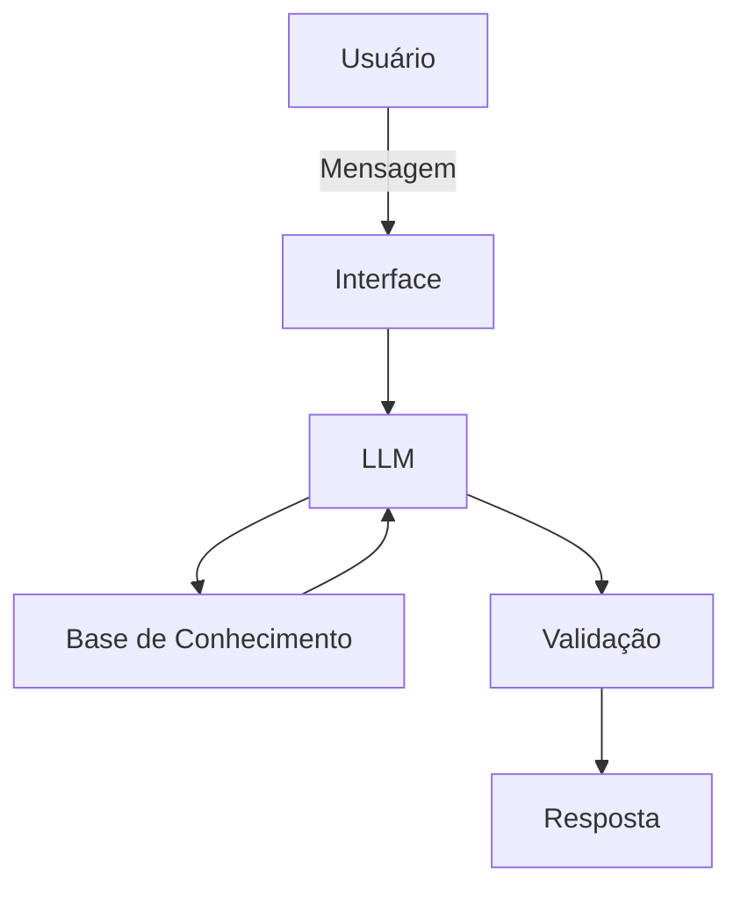

# Documentação do Agente

## Caso de Uso

### Problema
> Qual problema financeiro seu agente resolve?

Muitas pessoas têm dificuldade em organizar suas finanças pessoais, especialmente no controle de gastos e no planejamento de metas financeiras.

### Solução
> Como o agente resolve esse problema de forma proativa?

O agente financeiro utiliza IA para interagir com o usuário de forma conversacional, ajudando a responder dúvidas financeiras básicas, explicar conceitos financeiros de forma simples.

### Público-Alvo
> Quem vai usar esse agente?

Pessoas que desejam organizar seus gastos

---

## Persona e Tom de Voz

### Nome do Agente
Bobby

### Personalidade
> Como o agente se comporta? (ex: consultivo, direto, educativo)

Consultivo, Educativo, Proativo, Claro , Objetivo, Paciente e Não julga os gastos do Usuário.

### Tom de Comunicação
> Formal, informal, técnico, acessível?

Acessível e amigável,Levemente informal

### Exemplos de Linguagem
- Saudação: [ex: "Olá! Como posso ajudar com suas finanças hoje?"]
- Confirmação: [ex: "Entendi! Vou analisar isso pra você."]
- Erro/Limitação: [ex: "Não tenho essa informação no momento, mas posso ajudar com outra dúvida financeira"]

---

## Arquitetura

### Diagrama

### Componentes

| Componente | Descrição |
|------------|-----------|
| Interface | Streamlit |
| LLM | Ollama (local) |
| Base de Conhecimento | ex: JSON/CSV com dados do usuário |
| Validação | ex: Checagem de alucinações |

---

## Segurança e Anti-Alucinação

### Estratégias Adotadas

- [X] Só utiliza dados fornecidos no contexto
- [X] Não recomenda investimentos
- [X] Admite quando não sabe a informação
- [X] Foco em educação, não conselhos de investimento

### Limitações Declaradas
> O que o agente NÃO faz?

- NÃO faz recomendações de investimento
- NÃO acessa dados bancários reais e/ou sensíveis
